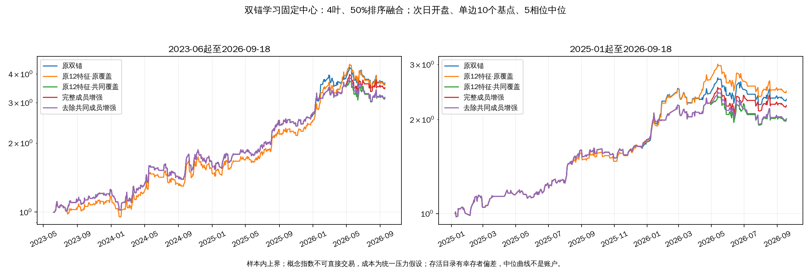

# 双锚候选学习与成分上涨比例研究预注册

2026-10-03。已完成两项假设及上市边界复验，共5670次账户回放，没有通过完整判据的方案。以下保留开跑前注册与执行修订，正式结论见文末。

用户授权完成本轮探索。本注册先于新增成员采集、双锚训练与收益读取；上一轮20组成员核验仅用于数据可行性判断。本轮研究以深证成指和中证1000双锚为主对照，不要求三锚先通过，不复用三锚候选或模型。

## 假设与冻结范围

假设一：同日候选相对收益学习在双锚上可能与三锚不同。假设二：更多成分股共同上涨、尤其去除与当日锚共有股票后仍共同上涨，可能提供原价格特征以外的信息。两项独立判断，不能以第二项失败否定第一项。

沿用原完整榜、分钟重排、持仓缓冲、止损、冷静期、次日开盘成交。只改变原榜排序，不另设入场拒绝。研究截止2026-09-18，不使用其后评价数据。历史经过多次探索，所有滚动检验仍是样本内上界；概念目录为存活快照回填，存在幸存者偏差；概念指数不可直接交易，成本是统一压力假设。

## 数据与时点

每日候选重新由双锚原引擎生成。按信号所属月份，查询前一月份最后一个交易日的概念与两锚成员，整月冻结使用；这测试的是月度更新成员方案，不冒充每日真实成员。历史查询无法证明当时发布时间，另留后续逐日留存验证条件。

只纳入沪深股票，不纳入北交所和其他市场；记录排除数，避免历史改码和不同交易制度混入首轮。使用只读本地后复权日收盘价，成交量须为正，价格和复权因子须有限且为正；当日绝对涨跌幅超过35%记无效，不填零。每组至少20只成员，最近5个交易日逐日价格有效覆盖均不低于90%，否则该候选特征无效。每个候选日须所有候选同时合格才进行增强排序；不根据未来目标可得性决定预测资格。

成分上涨比例定义为有效成员中当日收益大于零的数量除以有效成员数，平盘保留在分母。两项特征为当日比例和最近5交易日比例均值。去除共同成分上涨比例使用相同定义，但先剔除与当日锚相同月度名单共有的股票，分母重新计算。历史5日使用该信号日已知的同一冻结成员集合。最少20只和90%门槛也适用于剔除后集合。

成员请求先导出完整清单，顺序可恢复采集；明确无数据保留空集合，其他错误或配额耗尽停止，不以当前名单替代。新增请求上限2000组，超限即报告数据不足，不挑有利概念缩减。采集只经ops入口与resonance.ifind统一封装。收益回放前冻结全部原始响应摘要、本地价格切片和覆盖统计。增强特征合格候选日须覆盖原12特征合格日期至少60%，早期与近期分别至少60%，否则成分增强方向以数据不足收口，仅完成独立双锚原特征学习。

## 训练与对照

原12项特征、同日候选相对目标、训练252交易日、验证63日、两处各隔离6日、每21日重训、训练至少120个候选日、验证至少30日，与既有候选学习注册一致。目标为次日开盘至第六日开盘、双边各10个基点（1个基点=0.01%）扣费收益减同日候选平均收益。首次预测2023-06-01。使用qlib 0.9.7的浅树模型，叶数3/4/6，学习率0.05，最多60轮、早停15轮，每叶30行、种子0、两线程，无抽样。

四个特征组：原12特征原覆盖、原12特征共同覆盖、原12特征加完整成员两项比例、原12特征加去除共同成员两项比例。后三组严格使用同一训练、验证及预测日期；原覆盖组独立复验双锚，不与增强组直接归因。排序融合权重25%/50%/75%，同分保留原榜。四组各9个配置，共36个模型配置。另设5日动量、5日反转、完整成员当日比例、去除共同成员当日比例四个单因子，各3个相同融合权重；均采用共同覆盖与相同周期样本门槛。另补原覆盖动量与反转各3权重，避免双锚独立复验的覆盖混杂；原策略另作基准，共55组。

主中心为去除共同成员增强、4叶、50%融合。完整成员增强、4叶、50%为机制对照；原覆盖12特征4叶50%为独立双锚学习中心。只检验本矩阵，不看收益后增加模型或调整覆盖门槛。

## 账户评价与停止规则

主窗2023-06-01起、早期同日起至2024-12-31、近期2025-01-02起，末日2026-09-18。各窗起始5交易日分别空仓启动，期间账户连续；成本单边0、10、30个基点，共2475次回放。5相位仅检验起始扰动，若持仓收敛不称独立重复。缓存回放与原引擎净值、持仓、交易、止损逐笔等价后再跑矩阵。

采纳候选须全部满足：主窗10个基点下，相对原策略收益配对差中位至少+2个百分点、至少4/5相位胜出、最大回撤配对恶化不超过1个百分点、完整交易胜率至少提高3个百分点；早期和近期收益差各不低于-2个百分点；30个基点主窗收益差为正；主窗至少50笔完整交易、各子窗至少15笔；去掉最大贡献单月后对数收益差仍为正。必须有一个相邻叶数或相邻权重配置也通过上述要求。

增强模型还须在主窗及两个子窗胜过同参数共同覆盖12特征模型，主窗胜率差不为负，并胜过相同权重动量与反转对照；否则不能宣称新增信息有效。双锚原覆盖模型与原覆盖动量、反转比较，原覆盖改善不归功于成分信息。直接比例规则单独报告，不伪装为机器学习成功。

报告月份连续3个月成块重采样2000次的95%区间、年度贡献、实际排序与第一名变化、完整交易数、未结束交易、降级原因和计数。任何过线方案须再做次月第一个交易日成员使用前延后1个交易日、以及价格覆盖95%的预定敏感性复验；这些检查仅用于推翻候选，不再选新赢家。若无邻域候选则停止本轮，不围绕孤峰加参。即使通过也只列研究候选，生产和现行样本外评价不改。

## 实施计划与执行记录

使用writing-plans（实施规划）和executing-plans（顺序执行）技能；已有隔离工作区。实现以本注册为规格，过程写入本节，不额外建立计划树。

- [x] 数据准备：恢复cb600a3研究辅助用于复现，新入口research/constituent_breadth_prep.py导出双锚原榜与原特征。确认旧三锚工件未被覆盖。
- [x] 数据规则先测：tests/test_constituent_breadth.py覆盖月末选择严格早于信号月、共同成员删除后分母、平盘与缺价、整日候选降级；观察失败后实现research/constituent_breadth_common.py。
- [x] 成员采集：ops/collect_constituent_breadth.py调用统一封装；请求和响应留摘要，异常有记录。
- [x] 特征准备：research/constituent_breadth_features.py读取冻结成员与只读本地行情，输出四组共同日期与覆盖审计。质量门不通过则登记，不回填。
- [x] 模型与回放：research/constituent_breadth_train.py在qlib环境训练；research/constituent_breadth_eval.py在研究环境运行原引擎，research/constituent_breadth_assess.py逐条判据评价。
- [ ] 复核收口：完成必要测试、摘要与时点检查，保存实施提交后删除一次性脚本；结论并入本文和实验手册，明确已完成与未证实的边界。

复核重点：成员不能取信号月末；缺价不能填零；共同覆盖不能使用未来目标筛选；目标成熟必须早于下一段；模型预测不能影响原入场许可。上述五类分别由单元测试、桥文件断言和原引擎等价回放核验。

八项实验检查已逐项确认：新信息机制、冻结判据、单轴对照与邻域、五相位适配、覆盖计数、区别既有负结论、样本内上界及不可交易限制、退役代码入口自检。

执行记录：双锚生成622个候选日、3110条候选，602日原特征完整；成员请求1808组，未超2000组上限。四项数据边界测试先因缺失实现失败，实现后全部通过。原覆盖动量与反转对照在任何收益读取前补入，冻结矩阵为55组。

执行澄清（训练前）：独立审查发现旧评估辅助携带本轮未注册的动量对照胜率门槛，已删除；同覆盖12特征胜率非负要求保留。主矩阵过线仅为初筛候选，敏感性前不标为最终通过。成员延后1日复验定义为每月首个交易日增强信息无效、按注册降级原榜，第二个交易日起可用；训练与预测均重算，不借助缺失月份的更旧成员。

执行澄清（收益读取前）：独立审查指出旧月份汇总先逐月取相位中位可能拼接不同账户，已新增轮换盈亏反例测试并修正。现行去最佳月判据先在每个相位连续账户完成，再取相位中位；成块重采样对各相位使用同一月份索引，再汇总相位中位，不能把相位视为独立样本。

## 第二阶段独立注册：小成员集合的中性收缩（账户结果读取前）

第一阶段数据资格失败：602个原特征合格候选日仅201日增强共同合格，整体33.4%、早期32.3%、近期44.6%，未达60%线。完整成员少于20只影响310日，去除共同成分后少于20只影响398日；去除后价格覆盖不足90%影响115日，原因有重叠。该阶段不训练增强模型，仅完成720次双锚原覆盖模型及同覆盖动量/反转回放，原门槛和失败结论保留。

新假设：直接丢弃小成员概念会使学习集中于大成员集合。将小样本的上涨比例向中性值收缩，可能保留候选覆盖又降低少量股票引起的极端比例。这个注册发生在查看任何本轮账户收益之前，不以收益优劣选择方法。

新比例为（有效上涨股数+10）除以（有效成员数+20），等价于加入20个中性虚拟观测，其中一半上涨。仍须真实成员非空、五日逐日有效价格覆盖至少90%，不填入任何虚构价格；零成员、未知概念或无锚名单仍无效。完整成员与去除共同成员分别计算当日收缩比例及5日均值。此处明确取消20只真实成员的硬门槛并用统计收缩替代，不把第二阶段称为第一阶段过线。

第二阶段保持全部其他日期、样本、模型、成本、账户判据和55组矩阵不变，使用独立输出目录outputs/constituent_shrinkage（成分收缩研究产物）。四组共同覆盖重新冻结，仍须整体、早期、近期各达到原60%线；否则第二阶段也按数据不足结束，不继续降门槛。新增信息判断仍需胜过相同覆盖的原12特征，而不能归功于日期改变。

第二阶段若出现初筛候选，除原定95%价格覆盖、首日延后敏感性外，再以虚拟观测10与40两个预定强度复验同一中心及其过线邻域；两侧都须主窗增益为正、早期与近期收益差不低于-2个百分点，才保留候选。不得在强度10或40另找赢家。无初筛候选则停止本轮成分方向，不再改比例、成员门槛或模型网格。

实施方式：复用已冻结股票收益切片和月度成员，不再次请求数据；增加小样本收缩的手算测试，输出新特征摘要后独立训练和回放。第一阶段的720次回放结果保存原目录；第二阶段预计2475次，均不代表独立样本数量。

## 已完成的数据审计与第一阶段结果

实际采集1808组月度成员，覆盖375个指数代码（含两锚），查询日期从2021-12-31至2026-08-31；24组明确无数据。返回214391条成员记录，其中211545条为沪深股票；去重后的5329只股票用于只读行情切片。零成员和无锚名单没有用当前成员补齐，北交所成员按注册排除。原始响应和股票源文件摘要保留，可复查当时读取版本。

第一阶段因真实成员20只门槛及覆盖不足而未训练增强模型。第二阶段采用独立注册的中性收缩，共同合格候选日为471/602，整体78.2%，早期141/189即74.6%，近期229/240即95.4%，通过数据资格线；不能据此改称第一阶段通过。

### 独立双锚原特征复验

第一阶段720次连续账户回放完成，包含9个学习配置、6个原覆盖动量与反转对照、原双锚基准，以及成本、窗口、相位组合。9个学习配置均未通过完整单点判据。以下为2023-06-01起5个交易日分别空仓启动至2026-09-18、次日开盘、单边10个基点成本、5相位中位的样本内上界，基准为同池原双锚；差值先逐相位配对再取中位。概念指数不可直接交易，成本是统一压力假设，存活概念目录有幸存者偏差。

| 方案 | 总收益 | 最大回撤 | 完整交易胜率 | 相对原双锚收益差 | 胜率差 |
|---|---:|---:|---:|---:|---:|
| 原双锚 | +265.19% | -18.62% | 61.65% | — | — |
| 原12特征、4叶、50%融合中心 | +261.73% | -21.26% | 59.09% | -3.46个百分点 | -2.55个百分点 |
| 原12特征、6叶、50%融合邻域 | +270.57% | -19.36% | 59.09% | +5.39个百分点 | -2.55个百分点 |

4叶中心在2023-06-01相位族至2024-12-31、同开盘及单边10个基点、5相位配对的早期样本内上界口径下，相对原双锚收益差为-10.79个百分点；在2025-01-02相位族至2026-09-18的近期相同口径下，收益差为+14.32个百分点。近期改善不能抵消主窗胜率和早期表现未通过的事实。

原覆盖模型39个滚动周期中22个完成训练、17个因样本不足降级；实际评分236个候选日，早期78日、近期158日。原双锚主窗五相位持仓从2023-06-27起持续收敛，近期从2025-01-08起收敛，不能视为五次独立重复。该结论是独立双锚结果，不再由三锚失败间接推断。

### 第二阶段学习覆盖限制

共同覆盖原特征、完整成员增强、去除共同成员增强均只有8/39个滚动周期完成训练，31个按冻结要求降级；其中29个周期训练日期不足120日，22个验证日期不足30日，两者重叠20个周期。三个组训练、验证与预测日期完全一致。

三个组第一次实际评分均为2025-12-05，合计90个候选日；2024年末之前实际评分为零。早期账户若与原策略一致，是降级产生的结果，不是增强信息通过了跨周期检验。第二阶段仍完成矩阵以评价近期有限证据，但不能据早期“未拖累”宣称跨阶段有效。

## 扩大上市边界审计与数据纠正

对211545条沪深成员关系核对本地行情起点，发现11条名单日期早于股票本地起点。代表项已用交易所资料核实：英思特301622.SZ于2024-12-04上市，却出现在2024-11-29的苹果概念名单；豪恩汽电301488.SZ于2023-07-04上市，却出现在2023-06-30两个概念名单；赛伦生物688163.SH于2022-03-11上市，却出现在2022-02-28名单。

来源：[英思特上市通知](https://www.szse.cn/disclosure/notice/company/t20241203_610768.html)、[豪恩汽电上市公告书](https://disc.static.szse.cn/disc/disk03/finalpage/2023-06-30/d0eac802-c7d0-4bc0-98d1-b2a4cdc85b3a.PDF)、[赛伦生物公司章程](https://star.sse.com.cn/disclosure/listedinfo/announcement/c/new/2025-07-25/688163_20250725_PI2K.pdf)。

上市前归类可能包括预先公布的行业归属，不能仅据此断言所有历史分类都前视；但它不能未经处理就当作当时已上市、可观察的股票成员。本研究已按有效价格排除上市前收益，但仍可能在上市后使用此前名单中的记录，因此采用保守修正：只有本地股票行情起点不晚于成员快照日的股票才进入该整月冻结集合。未知起点也隔离，不用未来补齐。起点只是可观察价格边界，不冒充已逐只核实的官方上市日期。

原始响应保持不变；未隔离回放仅作数据污染诊断，正式结论以outputs/constituent_shrinkage_clean（上市边界隔离复验产物）为准。固定收缩强度20及所有样本、模型、成本、相位、判据不变，重新计算共同覆盖、训练、回放。不能从隔离前后挑较好结果。若隔离不影响特征或模型仍要记录实测等价，不能凭推测免验。该修正先于读取第二阶段增强收益，第一阶段不使用成分特征的模型不受影响。

上市边界修正实测：按冻结的股票起点元数据隔离11条成员关系后，16条候选特征记录变化，共同覆盖日期不变。所有学习模型预测均未变化，简单完整成员与去除共同成员评分各有2条变化，涉及2个日期；仍执行完整固定矩阵复验，不从未清理版本取较好收益。起点元数据副本及摘要、排除名单、变化行清单均保存。

源数据结束前复核：1808份成员响应与15537份存在的股票行情文件摘要均未变化；未覆盖的股票文件没有填造。本地股票起点并非逐只核实的上市日期；隔离已知边界异常仍不能排除已上市股票的概念归属事后回填，最终结果继续受此限制。

## 正式结果：本轮没有可采纳方案

本轮已完成5670次连续账户回放：第一阶段独立双锚复验720次、中性收缩初始矩阵2475次、上市前成员记录隔离后的正式复验2475次。包含成本、窗口、相位和重复验证，不是5670个独立样本。正式复验中54个非基准配置没有一个通过完整单点判据，因而没有邻域候选。按冻结停止规则，95%覆盖、月初延后及收缩强度10/40的条件敏感性复验未触发，不继续寻找新格点。

以下为2023-06-01起5个交易日分别空仓启动至2026-09-18、次日开盘、单边10个基点成本、5相位中位的样本内上界，基准为原双锚。学习模型统一列4叶、50%排序融合中心，简单规则列50%融合；增强与简单规则均使用中性收缩比例。差值先逐相位配对后取中位，不能直接用表内中位数相减。概念指数不可直接交易，成本为统一压力假设，存活目录和历史成员可能回填的偏差仍然存在。

| 方案 | 总收益 | 最大回撤 | 完整交易胜率 |
|---|---:|---:|---:|
| 原双锚 | +265.19% | -18.62% | 61.65% |
| 原12特征、原覆盖学习 | +261.73% | -21.26% | 59.09% |
| 原12特征、共同覆盖学习 | +214.26% | -19.42% | 61.36% |
| 完整成员增强学习 | +248.85% | -18.62% | 61.36% |
| 去除共同成员增强学习 | +216.56% | -21.26% | 60.61% |
| 简单完整成员比例重排 | +290.67% | -18.62% | 62.60% |
| 简单去除共同成员比例重排 | +301.51% | -18.62% | 62.60% |

完整成员增强中心在上述主窗、10个基点、5相位配对的样本内上界口径下，相对同覆盖原12特征改善收益34.59个百分点，但相对原双锚仍落后16.34个百分点。这只说明它部分修复了同覆盖学习模型的损失，不能称为优于原策略。去除共同成员增强中心在同一口径下，相对原双锚落后48.62个百分点，完整交易胜率下降1.04个百分点。

收益改善最大的学习格点为完整成员增强4叶75%：在相同主窗、成本、相位和样本内上界口径下，相对原双锚收益差为+48.59个百分点，但完整交易胜率下降0.75个百分点，未通过冻结要求。不能只按收益挑出这一格而忽略预设中心及胜率目标。

### 简单规则的观察价值与限制

简单去除共同成员的中性收缩比例、50%融合，在上述主窗、10个基点、5相位配对的样本内上界口径下，相对原双锚收益差为+36.32个百分点，完整交易胜率差为+0.94个百分点，未达到预注册+3个百分点要求。它在2025-01-02相位族至2026-09-18的近期相同成本及5相位配对口径下，相对原双锚收益差为+23.08个百分点；在主窗单边30个基点压力的5相位配对口径下，收益差仍为+23.16个百分点。以上同属概念指数研究上界，成本为统一压力假设，不能等同实盘收益。

这一简单规则只有90个候选日具备评分，主窗实际调用中排名变化29日、第一名变化14日，均为5相位中位；其月度对数收益差成块重采样区间包含零。早期没有任何实际评分，不能证明跨周期优势。主窗第3相位原双锚最大回撤发生在2024-01-31，早于增强组实际评分；主窗最大回撤相同也不能归功于增强规则的风险控制。

简单规则的同日候选位次相关性均值接近零，而部分增强模型相关性为正却账户表现更差，进一步说明预测相关性不能替代连续账户收益与完整交易胜率。这些诊断只用于解释，不据此改变方向或门槛。

### 复核、产物与停止边界

- 原引擎与缓存回放的净值、持仓、交易、止损及计数逐项等价。第二阶段原双锚和原覆盖12特征模型与第一阶段结果精确一致；增强组与共同覆盖原特征组的滚动切分、样本数和训练状态完全相同。
- 隔离前后2475组账户结果全部一致；简单评分的4条数值变化没有改变最终账户结果。这不代表可以忽略成员时点问题，正式结论仍使用隔离后的工件。
- 原行情、成员响应、股票源文件、桥文件摘要复核通过。实现阶段研究环境62项测试、固定qlib 0.9.7环境73项测试通过；qlib保留一条既有空均值警告。独立审查发现的额外门槛与月份混合问题已在收益读取前修正，并通过反例测试与独立复核。
- 正式工件位于`outputs/constituent_shrinkage_clean/`：`results.csv`（2475组账户结果）、`assessment.csv`（逐项判据）、`folds.csv`（学习覆盖）、`excluded_members.csv`（11条隔离记录）、`diagnostics.json`（等价和摘要核验）、`final_audit.json`（回放总数及停止原因）及净值图。原始查询和冻结个股收益切片位于第一阶段目录，未写入生产缓存。

图为固定学习中心对比，各窗口分别空仓启动，曲线是逐日净值的5相位中位；开盘、成本、时间窗口和样本内上界边界见图及上表。中位曲线不是可直接交易账户，不能把增强组启用前与原策略重合的部分解释为学习成功。

本轮成分方向与双锚原特征学习均收口，生产与现行样本外评价保持冻结。保留简单收缩比例为观察项，不晋升生产。重新启动至少应具备当时可见的成员快照证据，以及足够覆盖不同市场阶段的训练与独立评价样本；不能继续用这段历史调成员数量、融合权重或树叶数来寻找过线点。上市前记录隔离并未消除已上市股票归属事后回填、概念目录幸存者偏差及不可交易的边界。

最终独立只读复核确认正式结果表、5670次回放计数、54个非基准配置零通过、实际学习覆盖与条件敏感性停止理由均与工件一致。
