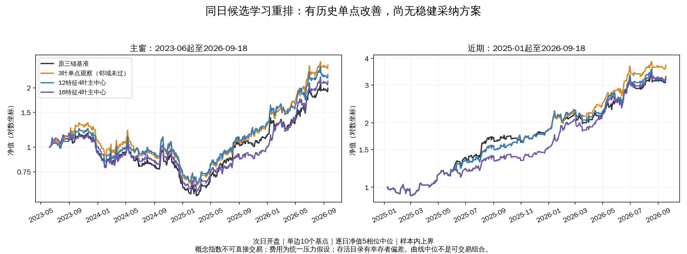

# qlib 自主探索汇总：暂不替换原策略

2026-10-03。按用户授权完成五轮预注册实验，共5115次连续账户回放。
这些次数包含成本、窗口和起始相位组合，不代表5115个独立样本。当前
没有方案同时通过收益、完整交易胜率、跨阶段、邻域及对照要求；生产
参数和现行样本外评价未修改，未使用2026-09-18之后行情。

## 五轮结果

| 实验 | 账户回放数 | 冻结问题 | 判定 |
|---|---:|---|---|
| [标签纠错](qlib-label-recheck.md) | 75 | 正向标签重训能否改善原学习重排？ | 两组模型仍未胜过原分钟重排 |
| [固定5日目标入场学习](qlib-decision-learning.md) | 1125 | 能否拒绝低质量新入场？ | 胜率改善不足，近期落后 |
| [候选相对收益重排](qlib-candidate-rerank.md) | 1395 | 能否比较同日候选并保留原排序？ | 有单点改善，邻域未通过 |
| [原退出规则交易目标](qlib-episode-learning.md) | 1125 | 对齐实际退出规则能否改善入场？ | 目标确有差异，实际胜率仍未改善 |
| [量价信息增强](qlib-volume-rerank.md) | 1395 | 新增成交量和日内结构是否有增量？ | 未胜过同覆盖旧特征对照 |

## 最值得保留的观察及其限制

同日相对收益目标、3叶树、50%排序融合权重，在2023-06-01起5相位至
2026-09-18、次日开盘、单边10个基点成本（1个基点=0.01%）、5相位中位
的样本内上界口径下，总收益为+160.66%，原三锚基准为+98.93%；同相位
收益差中位为+61.73个百分点，完整交易胜率由基准56.62%提高至60.14%，
配对改善3.53个百分点。概念指数不可直接交易，费用是统一压力假设，
存活目录存在幸存者偏差，以上不能解释为可实现的交易收益。

该参数点通过单点要求，但相邻叶数或融合权重没有同时通过。月份成块
重采样区间仍包含零；五个相位自2023-06-09后持仓收敛，不能当作五次
独立成功。后续同覆盖检验只减少5个合格特征日期，表现较好的参数点就
发生迁移，进一步说明历史单点的稳定性不足。因此保留观察，不采纳。

图中两个窗口分别独立空仓启动，曲线是逐日净值的5相位中位，均为单边
10个基点、次日开盘、样本内上界；原三锚曲线为比较基准。12特征4叶曲线
来自第三轮原覆盖，16特征来自第五轮；两者图上差异不能单独用于归因，
第五轮正式增量判断使用其同覆盖12特征对照。概念指数不可直接交易，
费用为统一压力假设，目录回填存在幸存者偏差。中位曲线不是可交易组合。

## 已确认的工程与研究改进

- 历史训练标签方向错误已修复并独立手算验证；旧回测收益不能直接取负，
  新模型已经重训，旧结论影响范围有明确记录。
- 模型只读研究环境导出的桥文件（两环境间的数据契约）；滚动训练严格
  隔离标签成熟日、验证段阈值和预测段。尾部目标未知的日期仍可预测。
- 所有策略仍由原引擎连续处理成交、换仓、退出、止损和冷静期；缓存与
  原引擎逐笔一致，完整交易按旧仓卖出开盘价结算，未结束交易不计胜负。
- 全部原行情与桥文件摘要均已核验；模型、预测、逐笔交易、真实决策、
  降级原因、相位收敛、年度与月份归因都保留，没有只保留赢家。
- 实验代码完整时，研究环境65项、qlib环境76项测试通过；qlib有一条
  既存空均值警告。前四轮独立只读审查完成；第五轮审查代理受使用额度
  限制未能执行，补做本地同覆盖、成熟边界和模型输入列核验，未冒充
  独立复核。四候选排序精度问题也已用失败测试复现后修正，本轮无受影响日期。

## 收口与后续边界

按第五轮开跑前冻结的停止规则，不继续在同一历史窗口微调门槛或增加
相似指标来寻找过线点。当前证据更支持保留原策略，把候选相对收益重排
作为待未来独立样本验证的研究假设；不把它加入正在评价的生产轨道。

再次启动需具备新信息或新独立评价数据，并先冻结候选及判据。下一轮
应优先检验：相对候选排序是否在未见时段仍同时改善完整交易胜率与收益，
以及这种改善能否跨固定锚池保持；不能重新挑本轮历史最好的参数后称为
独立验证。本文没有创建自动任务或新增生产运行轨道。

所有临时实施脚本和对应研究测试在完整提交 `cb600a3`（五轮实施快照）
中可追溯；按项目收口规则清理后，现行树保留结论文档。复现需一起恢复
五组研究脚本及辅助测试，因为跨轮共用数据加载、标签成熟及交易核算
函数。模型和数据表保留在本地各实验输出目录，原行情未写入版本库。

收口后，现行树研究环境54项测试通过。共享qlib环境在实验完成后已指向
另一个项目的开发版，版本保护使直接复核出现1项失败、2项初始化错误；
这不是本轮研究主动升级，也没有放宽项目0.9.7版本约束。随后在同一conda
qlib环境临时前置解包的0.9.7安装包，65项测试全部通过，仅保留既存空均值
警告；未覆盖共享安装或另一项目源码。恢复实验时仍须使用0.9.7，不能
把当前开发版当作本轮已核验的运行环境。
