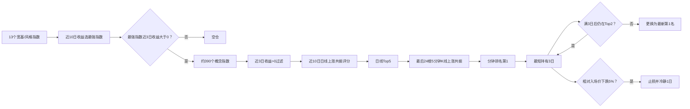

# 指数—概念上涨共振策略：截至2026-09-22最佳方案

## 1. 方案状态

| 项目 | 内容 |
|---|---|
| 当前版本 | V4.1 |
| 整理日期 | 2026-09-22 |
| 策略目标 | 先识别最强宽基/风格指数，再选择与其共同上涨程度最高的概念指数 |
| 日线核心样本 | 2025-01-01 至 2026-09-18 |
| 5分钟重排样本 | 2025-09-22 至 2026-09-18 |
| 数据来源 | 同花顺 iFinD 指数、概念指数及5分钟行情 |
| 组合形式 | 单组合、满仓或空仓，同一时间持有一个概念指数 |
| 当前结论 | V4.1是截至目前综合收益、回撤、夏普和成本稳健性最好的研究方案 |

本文件冻结当前最佳参数，作为后续每日信号计算和样本外验证的统一口径。个股观察池只是概念信号的执行映射，不属于已经完成回测的策略收益。

## 2. 策略结构



## 3. 指数池

使用以下13个宽基和风格指数识别当前市场主导风格：

| 类型 | 指数 |
|---|---|
| 全市场 | 同花顺全A |
| 大盘权重 | 上证50、沪深300、上证指数 |
| 中盘 | 中证500、深证成指 |
| 小盘 | 中证1000、中证2000 |
| 成长 | 创业板指、科创50、科创综指 |
| 极小盘 | 微盘股 |
| 北交所 | 北证50 |

每个交易日收盘后计算各指数近10个交易日复合收益率，选择最高者作为领先指数。

## 4. 入场闸门

满足以下条件才允许建立概念仓位：

1. 领先指数近3日复合收益率大于0；
2. 候选概念近3日复合收益率大于0；
3. 候选概念近10日日线数据完整；
4. 日线层至少存在一个有效候选；
5. 若条件不成立，组合保持现金。

共同下跌不计入共振评分。这样可以避免在市场急跌时，把指数和概念同时下跌误判为有效相关性。

## 5. 日线上涨共振

只使用领先指数上涨的交易日：

```text
日线上涨同步率_i
= Σ[w_t × I(领先指数收益_t > 0 且 概念i收益_t > 0)]
  / Σ[w_t × I(领先指数收益_t > 0)]

日线上行捕获率_i
= Σ[w_t × max(概念i收益_t, 0)]
  / Σ[w_t × max(领先指数收益_t, 0)]

日线上涨共振分数_i
= 日线上涨同步率_i × sqrt(clip(日线上行捕获率_i, 0, 2))
```

按日线上涨共振分数从高到低选出Top5，进入分钟重排层。

## 6. 动态半衰期

根据同花顺全A近10日路径最大回撤调整日线权重：

| 全A近10日最大回撤 | 半衰期 |
|---:|---:|
| 不超过2% | 5日 |
| 超过2%，不超过4% | 3日 |
| 超过4% | 2日 |

市场回撤加深时，旧周期数据更快失效，使策略更快寻找新一轮共同上涨方向。动态半衰期只改变历史权重，不放宽“共同上涨”条件。

## 7. 5分钟重排

### 7.1 观察范围

只对日线Top5读取当日最后24根5分钟K线，约对应收盘前2小时。

### 7.2 评分

只统计领先指数上涨的5分钟区间：

```text
分钟同涨比例_i
= 概念i与领先指数共同上涨的有效5分钟数量
  / 领先指数上涨的有效5分钟数量

分钟上行捕获率_i
= Σmax(概念i的5分钟收益, 0)
  / Σmax(领先指数的5分钟收益, 0)

分钟上涨共振_i
= 分钟同涨比例_i × sqrt(clip(分钟上行捕获率_i, 0, 2))
```

### 7.3 最终排序

当前推荐使用纯分钟重排：

```text
最终分数 = 0% × 日线分数 + 100% × 分钟分数
```

日线分数负责把约390个概念缩小到Top5，分钟分数负责决定Top5内部的最终顺序。

## 8. 持仓与换仓

| 规则 | 当前参数 |
|---|---|
| 初始建仓 | 买入最终排名第1的概念 |
| 最短持有期 | 3个交易日 |
| 排名检查 | 持有满3日后每日检查 |
| 持仓缓冲 | Top2 |
| 继续持有 | 原持仓仍在Top2 |
| 正常换仓 | 原持仓跌出Top2，换至最新第1名 |
| 无有效候选 | 清仓至现金 |
| 同时持仓数量 | 1个概念 |

策略不拆分为多组错峰资金。

## 9. 止损与重新入场

- 固定止损：相对本次入场价格下跌5%；
- 止损每日检查，不受最短持有3日限制；
- 止损按正常执行时序在下一交易日收盘执行；
- 止损后冷静1个交易日；
- 冷静期结束后，重新按完整信号判断是否入场。

## 10. 信号与执行时序

为避免未来函数，统一使用以下时序：

| 时点 | 操作 |
|---|---|
| T日收盘后 | 计算领先指数、日线Top5及5分钟最终排名 |
| T+1收盘 | 执行建仓、换仓、止损或清仓 |
| T+2 | 新持仓收益开始计入组合 |

概念A直接切换到概念B视为一次卖出和一次买入，成本计算两次。

## 11. 最佳方案回测结果

5分钟可用样本：2025-09-22至2026-09-18，共170个有效信号日。

| 单边成本 | 累计收益 | 最大回撤 | 年化夏普 | 2025样本段 | 2026样本段 | 换仓 | 止损 |
|---:|---:|---:|---:|---:|---:|---:|---:|
| 0bp | 108.94% | -19.46% | 2.35 | 25.02% | 67.12% | 61 | 4 |
| 10bp | 90.37% | -19.94% | 2.08 | 21.69% | 56.44% | 61 | 4 |
| 30bp | 57.96% | -20.96% | 1.52 | 15.27% | 37.03% | 61 | 4 |

## 12. 与同口径日线方案比较

比较区间、Top2缓冲和10bp成本均保持一致：

| 方案 | 累计收益 | 最大回撤 | 年化夏普 |
|---|---:|---:|---:|
| V4.1：日线Top5＋24根5分钟纯分钟重排 | 90.37% | -19.94% | 2.08 |
| 纯日线排序 | 67.05% | -21.63% | 1.67 |

加入5分钟重排后：

- 累计收益提高23.32个百分点；
- 最大回撤收窄1.69个百分点；
- 夏普提高0.40；
- 换仓次数由63次降低到61次；
- 止损次数由5次降低到4次。

## 13. 为什么选择纯分钟方案

10bp成本下，“25%日线＋75%分钟”取得最高样本内累计收益91.03%，比纯分钟方案高0.66个百分点。但纯分钟方案具备以下优势：

1. 夏普略高；
2. 2025样本段收益更好；
3. 年度之间更均衡；
4. 稳健评分第一；
5. 权重结构更简单，减少额外拟合参数。

因此当前冻结纯分钟方案，而不追求最高单点样本收益。

## 14. 每日执行流程

```text
1. 更新全部宽基、风格和概念指数日线。
2. 计算13个指数近10日收益，选择领先指数。
3. 检查领先指数近3日收益；不满足则空仓。
4. 对概念执行近3日正收益过滤。
5. 计算动态半衰期和日线上涨共振，选Top5。
6. 下载领先指数和Top5概念最后24根5分钟K线。
7. 只按分钟上涨共振对Top5重排。
8. 结合当前持仓、持有天数、Top2缓冲和5%止损生成指令。
9. T+1收盘执行，记录成本和下一次检查日期。
10. 保存数据完整性、信号和执行审计记录。
```

## 15. 个股映射规则

概念指数通常不能直接交易。当前只把个股交集池作为观察和未来执行研究：

| 层级 | 股票 | 代码 | 主要概念交集 |
|---|---|---|---|
| 核心 | 兴福电子 | 688545 | 国家大基金、存储芯片、中芯国际概念 |
| 核心 | 中巨芯 | 688549 | 国家大基金、存储芯片、中芯国际概念 |
| 核心 | 中芯国际 | 688981 | 国家大基金、存储芯片、中芯国际概念 |
| 弹性 | 长鑫科技 | 688825 | 国家大基金、存储芯片、科创次新 |
| 弹性 | 强一股份 | 688809 | 存储芯片、科创次新 |

该个股池尚未完成独立回测，不能直接使用概念指数回测收益评价这些股票。正式映射需要增加个股流动性、停牌、涨跌停、冲击成本和个股5分钟共振测试。

## 16. 当前风险与限制

1. 5分钟历史受账户权限限制，只覆盖约一年；
2. 参数选择和评价使用同一时期，存在样本内高估；
3. 日线完整样本与分钟样本区间不同，不能直接比较两者的绝对累计收益；
4. 当前未模拟概念指数到ETF或股票组合的跟踪误差；
5. 统一成本没有完全覆盖极端行情中的滑点和流动性冲击；
6. 个股映射层尚未回测；
7. 下一阶段应冻结本文件参数，补充更早分钟历史并开展滚动样本外验证。

## 17. 相关文件

- 5分钟回测报告：`../intraday_5m/回测报告.md`
- 回测可视化：`../intraday_5m/dashboard.html`
- 全部分钟参数实验：`../intraday_5m/experiments.csv`
- 数据完整性审计：`../intraday_5m/download_audit.csv`
- V4方案文档：`最佳方案_v4.md`
- 日线V3基线：`最佳方案_v3.md`
- 最新轮动分析：`../daily_rotation/2026-09-22_premarket/轮动分析.md`
- 回测脚本：`../intraday_resonance_backtest.py`

## 18. 冻结结论

截至2026-09-22，冻结方案为：

> **近10日选择最强风格指数；近3日正收益闸门；近10日日线上涨共振预选Top5；按全A回撤动态使用5/3/2日半衰期；使用收盘前24根5分钟K线纯分钟上涨共振重排；买入第1名；最短持有3日；满3日后跌出Top2才换仓；固定止损5%；冷静1日；T+1收盘执行；按10bp作为默认成本评估。**

后续测试应保持上述参数不变，新的数据仅用于样本外评价，不再根据短期结果反复修改参数。
