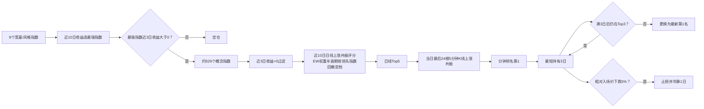

# 指数—概念上涨共振策略：现阶段方案 V4.2

## 1. 方案状态

| 项目 | 内容 |
|---|---|
| 当前版本 | **V4.2**（2026-09-22 定稿） |
| 版本链 | V3（纯日线）→ V4.1（用户冻结版）→ 池两轮调整（13→9）→ V4.2（两项优化采纳） |
| 策略目标 | 先识别最强宽基/风格指数，再选与其共同上涨程度最高的概念指数 |
| 分钟样本 | 2025-09-22 至 2026-09-18（HF 一年滚动限制），5 相位中位口径 |
| 组合形式 | 单组合、满仓或空仓，同一时间持有一个概念指数 |
| 实现位置 | `resonance/v3.py`（V3Params 生产值）；运行 `work/backtest_v41.py` |

本文件冻结现阶段参数，作为信号计算与后续样本外验证的统一口径。V4.1 原版
规格见 [v4-best-plan.md](v4-best-plan.md)，V4.2 优化验证见
[../outputs/v4/report_v42.md](../outputs/v4/report_v42.md)。

## 2. 策略结构



## 3. 指数池（9 个，用户两轮调整后）

| 代码 | 指数 | 状态 |
|---|---|---|
| 883957.TI | 同花顺全A | 半衰期基准（V4.1 规格）→ **已改为按领先指数** |
| 000001.SH | 上证指数 | V4.1 新增 |
| 883417.TI | 大盘股 | 2026-09-22 用户新增（日线+5min 已补齐） |
| 000300.SH | 沪深300 | |
| 000905.SH | 中证500 | |
| 000852.SH | 中证1000 | |
| 399006.SZ | 创业板指 | |
| 000688.SH | 科创50 | |
| 700050.TI | 微盘股 | 无 HF 5min 覆盖（两账号实测），其领先日分钟层回退日线序 |

已删：红利指数、国证2000（V4.1 时）；上证50、深证成指、中证2000、科创综指、
北证50（2026-09-22 用户指令）。

**⚠️ 池的实证警示**（docs/v41-pool-adjustment.md）：同一栈下 13 池（V4.1
原版）回测仍显著优于 9 池（V4.2 栈：+39.4%/−26.9% vs +25.1%/−24.4%，10bp
中位；V4.1 栈：+44.3%/−20.4% vs +8.2%/−28.9%）。9 池的 2025 段结构性偏弱。
维持 9 池为用户决定，13 池清单存 `work/collect_v41_topup.py POOL13`。

## 4. 入场闸门（同 V4.1）

1. 领先指数近 3 日复合收益 > 0；2. 候选概念近 3 日复合收益 > 0；
3. 概念近 10 日日线完整；4. 无有效候选 → 现金。

## 5. 日线上涨共振（同 V4.1）

只计领先指数上涨日：同步率 = Σw·I(共涨) / Σw·I(领涨)；捕获率 =
Σw·max(概念,0) / Σw·max(领先,0)；分数 = 同步率 × √clip(捕获率, 0, 2)。
观察窗 10 日，取 Top5 进入分钟层。共同下跌不计分。

## 6. 动态半衰期（**V4.2 变更：基准=当日领先指数**）

| 领先指数近10日最大回撤 | 半衰期 |
|---:|---:|
| ≤2% | 5日 |
| 2%~4% | 3日 |
| >4% | 2日 |

依据：概念跟随的是领先指数而非全市场，领先指数自身回撤才是对症的收紧信号
（B 轮：+15.4pp 收益 + 6.4pp 回撤改善，5/5 相位）。全A 基准保留为
`hl_source="allA"` 可选口径。

## 7. 5 分钟重排（维持 V4.1：当日最后 24 根）

对日线 Top5 读取当日最后 24 根 5min bar（约收盘前 2 小时），只统计领先
指数上涨的 bar：同涨比例 = 共涨 bar 数 / 领先上涨 bar 数；捕获率 = 全窗
正部收益比；分数 = 同涨比例 × √clip(捕获率,0,2)。最终排名 = 100% 分钟分。

**跨日窗已证伪不采纳**（C 轮，2026-09-22 用户指令验证）：72/96/144 bar
跨 2~3 日全部 −16pp 以上——含隔夜跳空收益的跨日窗退化为慢信号，与日线层
功能重叠（第四次"快慢挤占"证据）。数据已按 144bar 补齐后测得，非数据混杂。

## 8. 持仓与换仓（**V4.2 变更：Top3**）

| 规则 | 参数 |
|---|---|
| 初始建仓 | 买入最终排名第 1 |
| 最短持有 | 3 个交易日，满 3 日后每日检查 |
| 持仓缓冲 | **Top3**（原 Top2；A 轮 +7.3pp，5/5 相位） |
| 跌出 Top3 | 更换为最新第 1 名 |
| 无有效候选 | 清仓至现金 |

## 9. 止损与重新入场（同 V4.1）

固定止损 5%（相对入场价，每日检查、不受最短持有限制、T+1 收盘执行）；
止损后冷静 1 个交易日。V4.2 实测全年止损 4 次（5 相位中位，0bp）。

## 10. 信号与执行时序（同 V4.1）

T 收盘后计算信号 → T+1 收盘执行 → T+2 起计收益。A→B 切换计两次单边成本。

## 11. 现阶段回测结果（5 相位中位，2025-09-22→2026-09-18）

| 单边成本 | 累计收益 | 最大回撤 | 夏普 | 2025段 | 2026段 |
|---:|---:|---:|---:|---:|---:|
| 0bp | +36.72% | −23.81% | 1.06 | −8.25% | +49.01% |
| 10bp | **+25.07%** | −24.42% | 0.81 | −10.52% | +39.77% |
| 30bp | +4.64% | −28.74% | 0.31 | −14.89% | +22.94% |

其他（0bp 5 相位中位）：持仓变更 45 次，止损 4 次，空仓日 17.6%。

**参照系（10bp 中位）**：V4.1 锚点（会话端 13 池）+90.37%/−19.94%/2.08；
本机 13 池 V4.1 +44.25%/−20.42%/1.24；本机 13 池 V4.2 +39.44%/−26.87%/1.12；
本机 9 池 V4.1 +8.24%/−28.89%/0.41。同期全A +1.8%。

## 12. 参数冻结清单

```python
V3Params(leader_window=10, pos_window=3, res_window=10, dd_window=10,
         dd_tiers=(0.02, 0.04), half_lives=(5, 3, 2),
         topk=3, min_hold=3, stop_loss=0.05, cooldown=1,
         cost_bp=10.0,            # 决策口径
         stop_mode="close", exec_lag=1,
         defense_dd=0.0,          # V3 系防御层：V4.x 不启用
         daily_top=5, minute_bars=24,
         hl_source="leader")      # V4.2 变更
```

## 13. 已验证并存档的负结论（勿重复试验）

1. 跨日分钟窗 72/96/144bar：HARMFUL（第四次快慢挤占）；
2. 盘中（5min）止损粒度：固定止损上全面差于收盘确认（第三次快慢挤占）；
3. 池 13→9：两栈一致 −36~−45pp（用户保留 9 池为决策，非数据结论）；
4. 概念池剔大杂烩（成分股>200 只）：逐位无影响（评分天然压制宽基化概念）；
5. V3 十轮参数邻域：规格值逐轴局部最优；正收益过滤窗 P5 孤峰已证伪；
6. dyn5 系（20日Pearson+5日调仓）：盘中止损 B4% 有效但属另一策略族。

## 14. 风险与限制

1. 全部数字样本内（数据参与规格制定与本轮筛选；锚点 +90.37% 尤其含会话端
   2,457 组网格的样本内最优）；
2. 概念目录为快照回填，幸存者偏差；候选宽度直接抬高样本内上限（529→203
   交集实验：+44%→−3%）；
3. 概念指数不可直接交易，个股/ETF 映射未回测（V4.1 §15 观察池不属回测收益）；
4. 微盘股领先日（约 18-20 个/年）分钟层永久回退日线序；
5. 9 池 2025 段为负（−10.5%@10bp），池结构代价未被 V4.2 完全修复；
6. 下一步必做：冻结本文件参数做滚动样本外验证。

## 15. 每日执行流程

```text
1. 更新 9 池指数与概念日线、Top5 候选与领先指数的当日 5min（尾盘 24 根）。
2. 计算 9 指数近 10 日收益，选领先指数。
3. 领先指数近 3 日收益 ≤0 → 空仓。
4. 概念近 3 日正收益过滤 + 10 日完整性。
5. 计算领先指数自身近 10 日回撤 → 半衰期档位（5/3/2 日）→ 日线上涨共振 Top5。
6. 读取 Top5 与领先指数当日最后 24 根 5min bar，纯分钟上涨共振重排。
7. 结合持仓天数、Top3 缓冲、5% 止损生成指令。
8. T+1 收盘执行，记录成本与下次检查日。
9. 落盘数据完整性、降级计数（领先缺bar/概念剔除）与执行审计。
```

（每日 runner 依赖当日增量数据接口，待实现——见 §16。）

## 16. 待决与后续

| 事项 | 状态 | 责任/条件 |
|---|---|---|
| 池 9 vs 13 | **待用户定夺** | config.V41_BROAD_POOL 一处切换即重跑 |
| 冻结参数滚动样本外验证 | 必做 | 新数据仅作评价不再调参（沿 V4.1 §18） |
| 每日信号 runner | 待实现 | V4.1 §14 十步流程的工程化 |
| 个股/ETF 映射回测 | 未开始 | V4.1 §15 观察池 |
| 分钟历史扩展 | 受限 | HF 一年滚动+账号权限；正式账号可解 |

## 17. 复现命令

```bash
conda run -n resonance python -m pytest -q                    # 54 项离线测试
conda run -n resonance python work/backtest_v41.py            # V4.2 生产栈 + 纯日线对照（5 相位×3 成本）
conda run -n resonance python work/backtest_v3.py             # V3 线锚点对照（研究备选）
conda run -n resonance python work/collect_v41_topup.py       # Top5 需求矩阵 5min 增量补采
```

## 18. 冻结结论

> **近 10 日在 9 指数池选最强风格指数；近 3 日正收益闸门；近 10 日日线上涨
> 共振预选 Top5，EW 半衰期 5/3/2 日按领先指数自身近 10 日回撤 2%/4% 定档；
> 当日最后 24 根 5 分钟纯分钟上涨共振重排；买入第 1 名；最短持有 3 日；
> 满 3 日后跌出 Top3 才换仓；固定止损 5%；冷静 1 日；T+1 收盘执行；
> 10bp 为默认决策成本。**

后续测试保持上述参数不变，新数据仅用于样本外评价。
