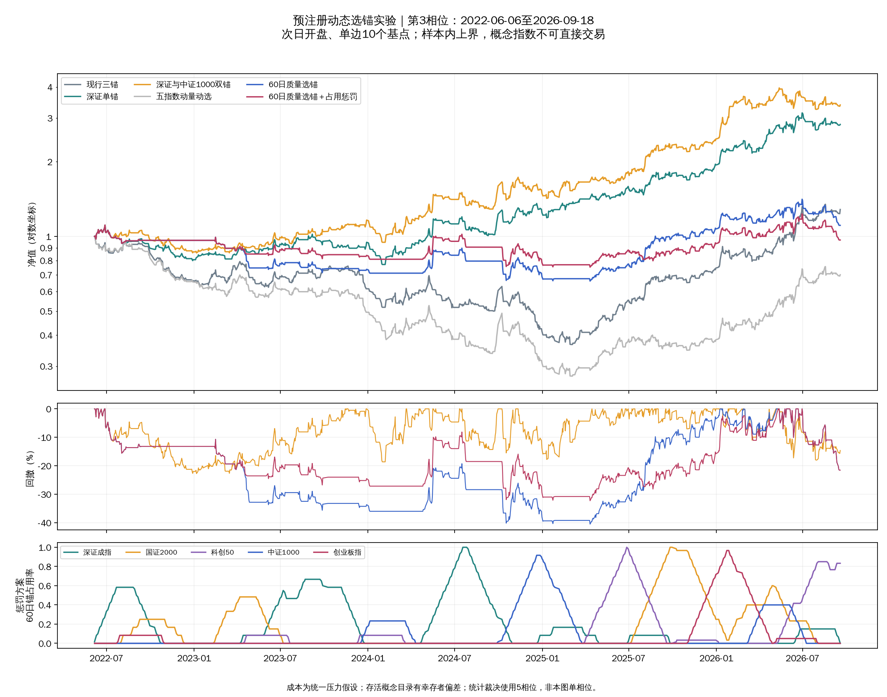

# 动态选锚实验产物

结论与全部口径见[预注册及最终报告](../../docs/research/anchor-selection.md)。
本轮只使用截至2026-09-18的历史数据，概念指数不可直接交易，成本为统一
压力假设，存活目录存在幸存者偏差；结果均为样本内上界。



图的窗口为2022-06-06至2026-09-18，次日开盘、单边10个基点成本，比较
双锚等既定对照；它是单相位展示，不替代报告的5相位中位统计。

## 文件

| 文件 | 内容 |
|---|---|
| `results.csv`（主矩阵明细） | 720次实际账户回测；逐相位收益、回撤、成本、占用与分钟事件 |
| `medians.csv`（相位中位表） | 按窗口、成本、方案取中位数；不能替代配对差判据 |
| `paired_tests.csv`（配对检验表） | 两条主规则相对各自预注册对照的差值、胜出相位 |
| `daily_diagnostic.csv`（纯日线诊断明细） | 45次固定配置实际账户回测 |
| `daily_diagnostic_paired.csv`（纯日线配对检验） | 补充诊断的两个主比较 |
| `decisions.csv`（逐日选锚记录） | 10个基点两条主规则的锚、评价日、资格数与惩罚 |
| `occupancy.csv`（锚占用明细） | 每个方案、相位与窗口内五锚占用天数及分母 |
| `years.csv`（年度分解） | 实际连续账户的年度收益；首尾年度可能不足全年 |
| `shadow_nav_phase*.csv`（单锚纸面净值） | 主成本五个预热相位、五个固定锚的净值历史 |
| `shadow_stats.csv`（单锚纸面统计） | 主矩阵75次纸面回测的交易与分钟事件统计 |
| `nav_*.csv`（实际账户净值）、`trades_*.csv`（实际逐笔交易） | 10个基点六个重点方案、三窗口、五相位的原始记录 |
| `phase_convergence.csv`（相位收敛核验） | 主窗口六个方案最后一次成交分歧及后续共同成交日期数 |
| `data_audit.json`（数据审计） | 数据截止、原文件内容摘要、非交易日历记录、原引擎一致核验 |
| `verification.json`（交付核验） | 配置完整性、报告数字与输入文件未变核验 |
| `nav_comparison.png`（研究图） | 固定第3相位，未按结果选择最好曲线 |

逗号分隔数据表与审计文件按仓库规则不进入版本控制，保留在本工作树；
报告和图进入版本控制。原始行情仍仅保留主仓生产副本，本目录不复制行情。

## 数据表口径

- `window`（评价窗口）：`main`（主窗口）、`early`（早期窗口）、
  `recent`（近期窗口）；确切相位与终点以预注册为准。
- `variant`（实验方案）：`dual`（深证与中证1000双锚）、`single`（深证单锚）、
  `trio`（现行三锚）、`momentum5`（五指数动量动选）；`quality60_p0`（60日
  质量选锚、无惩罚）、`quality60_p0.1`（同规则、惩罚强度0.10），其余配置
  以相同命名表示评价窗口与惩罚强度。
- `phase`（相位编号）、`start`（评价首日）、`end`（末日）、`cost`（单边成本，
  单位为基点）、`lookback`（质量观察天数）、`penalty_strength`（惩罚强度）。
- `total`（总收益）、`dd`（最大回撤，负数）、`sharpe`（夏普比率）以原始
  小数记录；`delta`（配对收益差中位数）、`dd_delta`（配对回撤差中位数）
  同样使用小数，回撤差为负表示恶化，乘100才是百分点。
- `wins`（收益严格胜出相位数）；`occupancy_median_delta`（两个最大滚动
  占用率相位中位数之差）是集中判据；`occupancy_delta`（配对占用差
  中位数）只作诊断。
- `max_occupancy`（最大总体占用率）保留无锚日在分母；
  `max_conditional_occupancy`（有锚日条件占用率）排除无锚日；
  `max_rolling_occupancy`（最大60日滚动占用率）使用固定60日分母。
- `longest_anchor_run`（最长连续占用天数）、`anchor_transitions`（含进入或
  离开无锚状态的锚变化次数）、`no_anchor_days`（无锚日）、`flat_days`（实际
  空仓日）含义不同，不互相替代。
- `anchor`（所选锚代码）、`review`（当日是否周度评价）、`eligible_count`
  （合格锚数）、`quality`（当前锚质量分）、`penalty`（当前锚扣分）。
- `minute_layer_days`（分钟层调用日）、`minute_fallback_leader`（锚缺窗口
  回退次数）、`minute_excluded`（概念缺窗口剔除次数）、
  `minute_fallback_sparse`（可评不足或无有效分数回退次数）、
  `audit_stale_concept_windows`（候选陈旧窗口次数）按预注册第四节计数。
- `trade_hash`（完整交易序列内容摘要）不能用于证明相位独立；报告另核对
  最后一次分歧之后的共同成交序列。

## 复现

实施与测试在提交 `e72f5ad`（完整实施快照）留档，随后按项目规则从现工作树
删除。复现时从该提交提取本轮研究脚本与测试，在 conda resonance 环境下
运行主矩阵，再运行其纯日线诊断选项；输入文件内容摘要见数据审计。
不需要访问任何行情网络接口，也不应运行每日样本外程序。

在该提交的独立检出目录中，复现命令为：

```bash
conda run -n resonance python -m pytest -q
conda run --no-capture-output -n resonance python research/anchor_selection_run.py
conda run --no-capture-output -n resonance python research/anchor_selection_run.py --daily-diagnostic
```

`--daily-diagnostic`（纯日线诊断选项）只执行固定补充对照，不搜索参数。
脚本默认只读主仓数据；异机复现可用 `--data-root`（行情数据目录）指定
与记录一致的数据副本。
