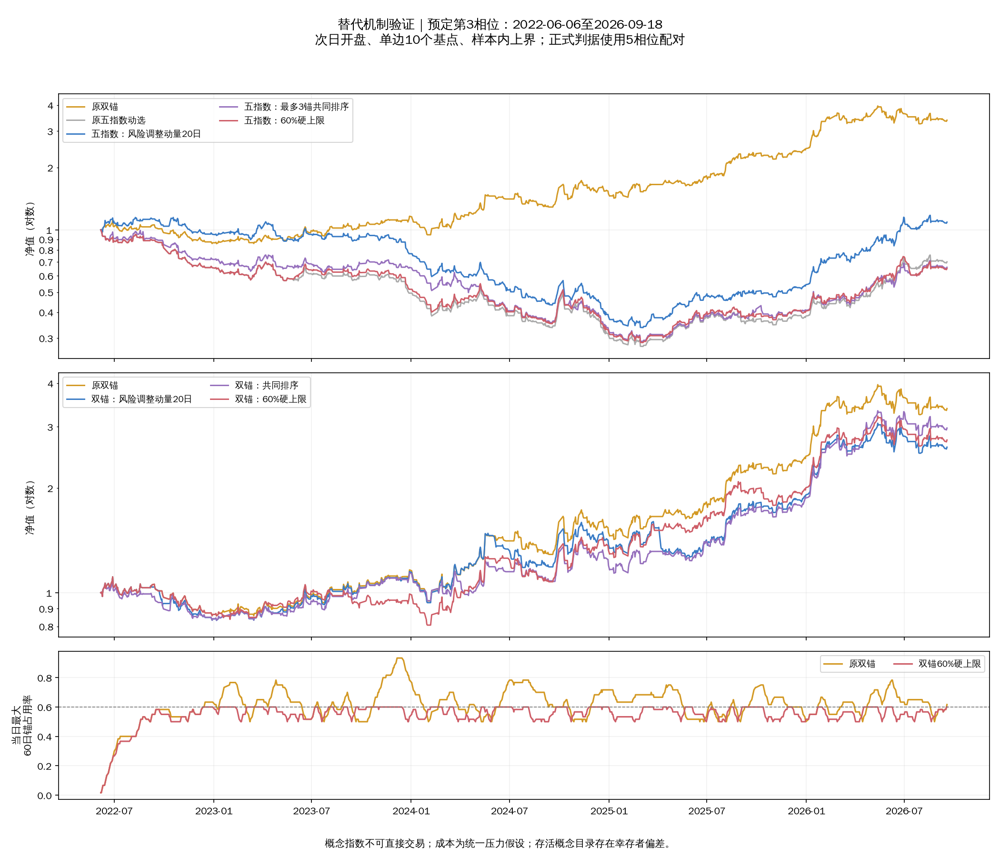

# 共振寻优替代机制产物

规则、判据与结论见[预注册报告](../../docs/research/resonance-alternatives.md)。
研究截止2026-09-18；所有绩效为样本内上界。概念指数不可直接交易，成本
为统一压力假设；存活目录存在幸存者偏差，不替代样本外验证。

## 文件与字段

- `results.csv`（逐次回测结果）、`medians.csv`（5相位中位）：主矩阵675次，
  纯日线诊断60次。`mode`（运行形态）为 `production_shape`（开盘执行及
  原分钟层）或 `daily_only`（纯日线）；`window`（评价窗口）为
  `main`（主窗）、`early`（早期）、`recent`（近期）。
- `variant`（方案标识）：`dual`（深证与中证1000双锚）、`single`（深证单锚）、
  `trio`（现行三锚）、`momentum5`（原五指数动量动选）；`risk20`（20日波动
  观察窗的风险调整动量）、`consensus3`（最多3锚共同排序）、`cap60`（60%
  锚占用硬上限）为中心配置，其余数字分别表示观察天数、参与上限和占用百分比。
- `phase`（相位）、`start`（首日）、`end`（末日）、`cost`（单边基点成本）、
  `total`（总收益）、`dd`（负数形式的最大回撤）、`sharpe`（夏普比率）、
  `cash_days`（实际空仓日数）、`trade_hash`（交易记录内容摘要）。
- `max_rolling_occupancy`（最大60日锚占用率）、`max_occupancy`（全期最大
  锚占用率）、`max_conditional_occupancy`（有锚日条件占用率）、
  `longest_anchor_run`（最长连续选中天数）、`anchor_transitions`（选锚变更
  次数）、`no_anchor_days`（未指定锚日数）仅用于单锚选择，不能用于多锚。
- `max_mean_contribution`（全期最大平均评分贡献）、
  `max_conditional_contribution`（有参与日最大平均贡献）、
  `max_rolling_contribution`（最大60日平均贡献）、
  `single_contributor_days`（单锚参与日数）、`no_contributor_days`（无参与日数）
  仅用于多锚共同排序；其他方案相应字段留空，不补成零。
- `paired_tests.csv`（配对比较）：`candidate`（候选方案）、`baseline`（对照）、
  `delta`（逐相位总收益差的中位）、`wins`（胜出相位数）、
  `dd_delta`（逐相位最大回撤差中位）、`occupancy_median_delta`（两组最大
  60日占用率中位数之差）。收益与回撤是原始小数，乘100才是百分点。
- `selections.csv`（每日选锚记录）中的 `anchor`（所选锚）包含闭闸日；
  `contributions.csv`（每日各锚评分贡献）中以指数代码命名的列是权重，
  无参与日全部为零。贡献权重不代表资金仓位。
- `years.csv`（连续账户年度分解）中的 `year`（年份）首尾可能不完整；
  `phase_convergence.csv`（相位收敛审计）中的 `last_trade_disagreement`
  （最后一个相位成交分歧日）用于提示5相位并非5条独立重复路径。
- `nav_*.csv`（10个基点净值）、`trades_*.csv`（同口径逐笔交易），覆盖所有
  主矩阵和纯日线方案。`data_audit.json`（数据审计）记录截止、原文件摘要、
  输入未变及原引擎等价检查；`verification.json`（交付检查）记录矩阵完整性
  和结论核验。

分钟与降级计数采用与上一轮[字段字典](../anchor_selection/README.md)相同
的名称；多锚下陈旧锚按锚窗口次数计，不等同于天数。分钟事件与
`selection_single_contributor`（引擎实际查询榜单时单锚参与次数）、
`selection_no_contributors`（实际查询时无参与次数）、
`selection_contributor_count`（实际查询时参与锚次数合计）仅在原引擎请求
榜单时累计；逐日全量参与天数以贡献表和对应天数字段为准。

数据表与审计文件按仓库规则留在工作树、不进入版本控制；行情不复制。

集中度汇总先截取各评价窗口，再计算60日滚动占用或贡献；窗口开始不足
60日时按空缺补齐分母60。这只影响汇总边界，硬上限规则实际选择所用的
历史仍从完整日历连续预热，没有随评价窗口或相位重置。

## 固定池复验与派生审计

`pool_interaction/`（固定池交互复验）保留同名格式的第二轮975次结果，
其中855次为主形态、120次为纯日线。方案前缀 `dual_`（双锚池）与
`trio_`（三锚池）限定候选池，其余含义不变。与首轮重复的对照不是独立证据。

`verdicts.csv`（冻结判据核验）覆盖28个非对照配置，`center`（是否预定
中心）、`return_pass`（收益改善达标）、`phase_pass`（胜出相位达标）、
`drawdown_pass`（回撤限制达标）、`early_pass`（早期不反效）、
`recent_pass`（近期不反效）、`cost_pass`（成本压力同向）、
`performance_pass`（全部绩效判据通过）、`neighbor_pass`（预定邻域通过）、
`occupancy_improvement_pass`（相对原池占用改善达标）、
`eligible_for_next_validation`（是否满足进入后续验证要求）均按预注册计算。
`main_delta`（主窗配对收益差）、`main_wins`（主窗胜出相位数）、
`main_dd_delta`（主窗配对回撤差）是对应数值。

`selection_effect_phase3.csv`（第3相位选锚变化解释）是事后账单核对，
不用于重新选择参数。`different_selection_days`（相对原双锚选锚不同天数）、
`both_gate_closed`（不同天数中两者均闭闸）、`either_gate_open`（至少一者
开闸）、`no_anchor`（未指定锚天数）、`different_trade_dates`（逐笔交易
不同日期数）用于判断硬上限实际触发是否充分。

原引擎另报 `entries`（入场次数）、`switches`（换仓次数）、`exits`（退出
次数）、`position_changes`（入场与换仓次数合计）；不能把后者当成全部
买卖委托次数。两轮完整交易和年度数据均保留，便于复查。

